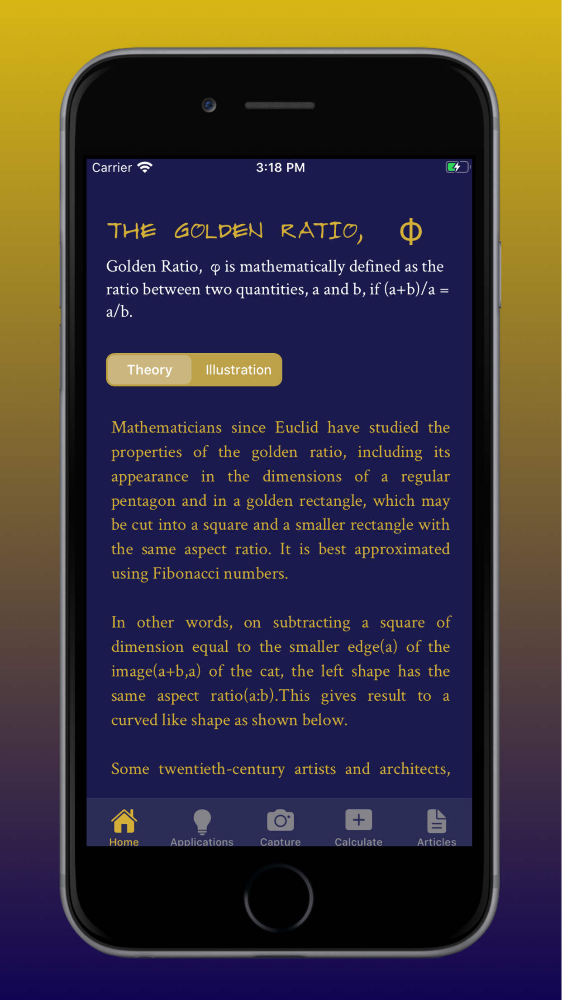

# Golden Ratio App

 

This App lets users learn about the concept of Golden Ratio, explore its applications and implement it in their daily lives.

## Introduction

Two quantities are in the golden ratio if their ratio is the same as the ratio of their sum to the larger of the two quantities. It is used widely in the field of design and has applications in almost every other field too. This App explains the concept of Golden Ratio. It also lets the user explore its applications and its importance in the present day. It also lets them implement golden ratio in an interactive manner.

## Steps to Run
* Clone or download the the repository. 
* Open project file in terminal.
* Open `goldenRatioApp.xcodeproj`.
* Change the bundle identifier.
* Press `Ctrl + R` to run the app.
 
## How to Use

This App contains five tabs:
* Home tab: contains the theoretical and pictorial representation of Golden Ratio.
* Applications tab: contains illustrations of its applications in various fields.
* Capture tab: lets user import images and find out golden rectangles in them.
* Calculate tab: calculates golden ratio edges for a user-input measurement.
* Articles tab: lists recent news articles related to the Golden Ratio and leads to respective websites.

## Libraries Used
* UIKit
* Vision
* ImageIO
* SafariServices

## Project Screenshots

 
 
 
 
 
 
 
 

## License
Read [LICENSE](../master/LICENSE) for details.

## Author
[Swamita Gupta](https://github.com/swamitagupta)
